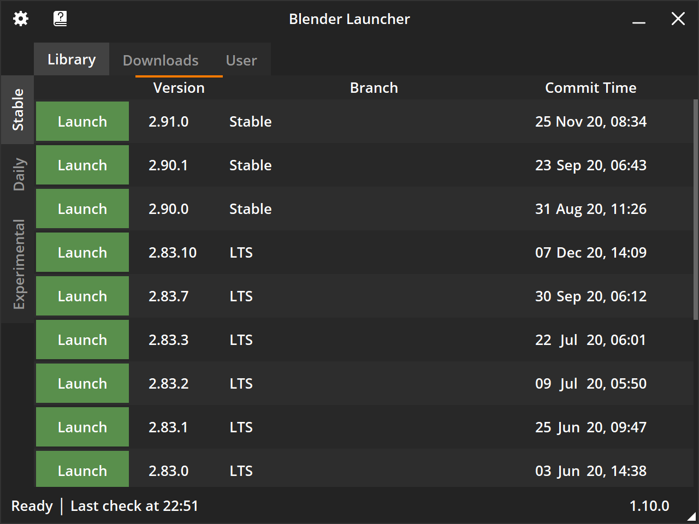
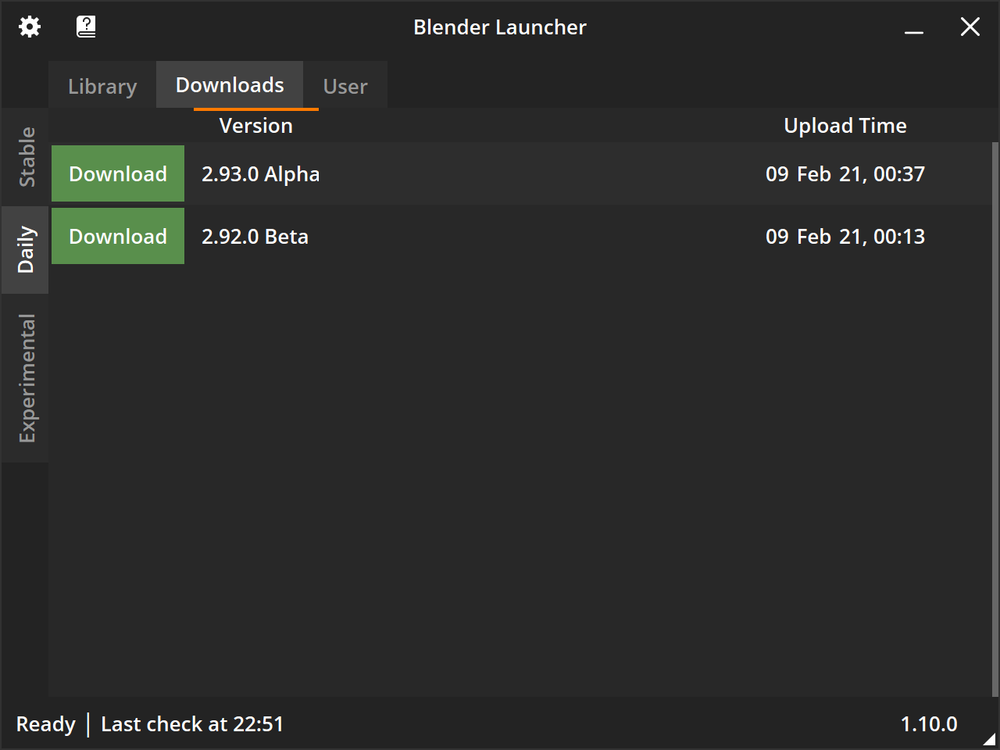
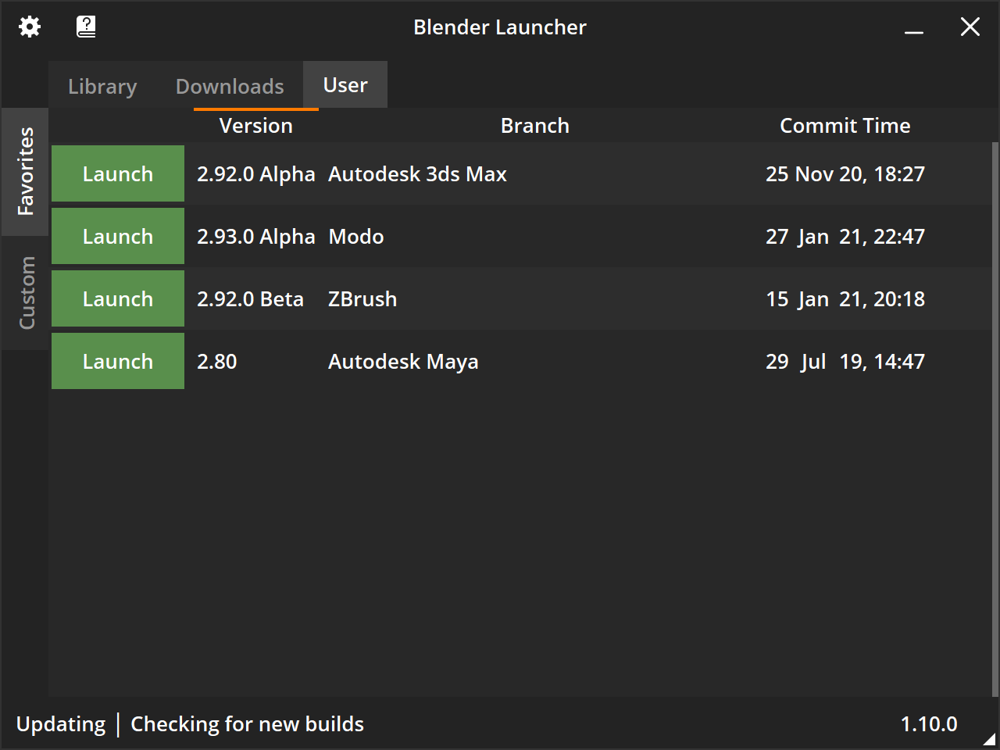
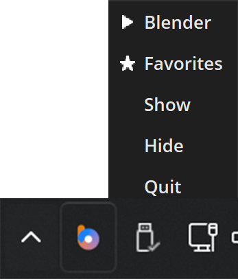

# Introduction

[:fontawesome-brands-windows: Get for Windows](https://github.com/Victor-IX/Blender-Launcher-V2/releases/download/v4.5.2/Blender_Launcher_v4.5.2_Windows_x64.zip){: .md-button .md-button--primary style="display: inline-block; float: left; width: 49.75%; text-align: center; border-radius: 0px;"}
[:fontawesome-brands-apple: Get for MacOS](https://github.com/Victor-IX/Blender-Launcher-V2/releases/download/v4.5.2/Blender_Launcher_v4.5.2_macos_arm64.zip){: .md-button .md-button--primary style="display: inline-block; float: left; margin-left: 0.5%; width: 49.75%; text-align: center; border-radius: 0px;"}

[:fontawesome-brands-linux: Get for Linux](https://github.com/Victor-IX/Blender-Launcher-V2/releases/download/v4.5.2/Blender_Launcher_v4.5.2_Linux_x64.zip){: .md-button .md-button--primary style="display: inline-block; float: left; width: 33%; text-align: center; border-radius: 0px;"}
[:fontawesome-brands-ubuntu: Get for Ubuntu](https://github.com/Victor-IX/Blender-Launcher-V2/releases/download/v4.5.2/Blender_Launcher_v4.5.2_Ubuntu_x64.zip){: .md-button .md-button--primary style="display: inline-block; float: left; margin-left: 0.5%; width: 33%; text-align: center; border-radius: 0px;"}
[:fontawesome-solid-download: All Releases](https://github.com/Victor-IX/Blender-Launcher-V2/releases){: .md-button .md-button--primary style="display: inline-block; float: left; margin-left: 0.5%; width: 33%; text-align: center; border-radius: 0px;"}

 
 

## Original [Project](https://github.com/DotBow/Blender-Launcher) By [DotBow](https://github.com/DotBow)

>  This project exists because [DotBow/Blender-Launcher](https://github.com/DotBow/Blender-Launcher) has been inactive since October of 2022. It was archived on the 28th of November, 2023 and no longer receives updates.
> 
## What is Blender Launcher?

Blender Launcher is a standalone software client that provides management for stable, daily and experimental builds of [Blender 3D](https://www.blender.org/). It is a free open source project available for 64-bit Windows and Linux (GLIBC 2.27 and higher) operating systems.

??? image "Screenshots"

    <figure>
      
      <figcaption>Library Tab, Stable Page</figcaption>
    </figure>
    <figure>
      
      <figcaption>Downloads Tab, Daily Page</figcaption>
    </figure>
    <figure>
      
      <figcaption>User Tab, Favorites Page</figcaption>
    </figure>
    <figure>
      
      <figcaption>Tray Icon</figcaption>
    </figure>

## Why do I need it?

The goal of Blender Launcher is to make it easier to stay up to date with the latest features and improvements of Blender 3D together with the security of stable releases. Since it is a minimalistic portable application, it is a nice tool for organizing the evolving, free, and open source 3D creation suite.

## What features does it have?

Core features:

* Automatic checking for the latest Blender builds.
* Simple Blender build update.
* Quick access to your favorite builds via the tray context menu or by middle clicking on the tray icon.
* Register .blend file extension for your preferred build or the last saved build.
* Startup arguments for launching Blender.
* Template installation.
* Indication of running builds and its number of instances.

Compared to its [predecessor](https://github.com/DotBow/Blender-Version-Manager), Blender Launcher introduces a number of major improvements:

* It's rewritten from the ground up for better stability and extensibility.
* All official builds, as well as popular Blender forks, are available:
    * [Stable releases](https://download.blender.org/release/)
    * [Daily builds](https://builder.blender.org/download/daily/)
    * [Experimental branches](https://builder.blender.org/download/branches/)
    * [Bforartists](https://www.bforartists.de/download/) - UI-focused fork
    * [UPBGE](https://upbge.org/) - Game engine fork (Stable and Weekly builds)
* Version consistent .blend file opening
* Faster starting times by caching data
* Support for high DPI displays
* And many new quality of life features!

Learn more about supported forks in the [Blender Forks](blender_forks.md) documentation.

## How to start using it?

* :fontawesome-solid-download: Download the [latest version](https://github.com/Victor-IX/Blender-Launcher-V2/releases/latest) from the [releases page](https://github.com/Victor-IX/Blender-Launcher-V2/releases)
* :fontawesome-solid-rocket: Follow the [Installation](installation.md#installing-blender-launcher) instructions and notes
* :fontawesome-solid-comment: Ask questions and make proposals in the Blender Artists Community [thread](https://blenderartists.org/t/blender-launcher-standalone-software-client) or in our [Discord](https://discord.gg/3jrTZFJkTd)

## How to thank the developer?

* :fontawesome-solid-face-smile:{: .emoji } The best reward is feedback and a happy user face!

***

:octicons-heart-fill-24:{: .heart } Thanx for using Blender Launcher! Have a good day!
